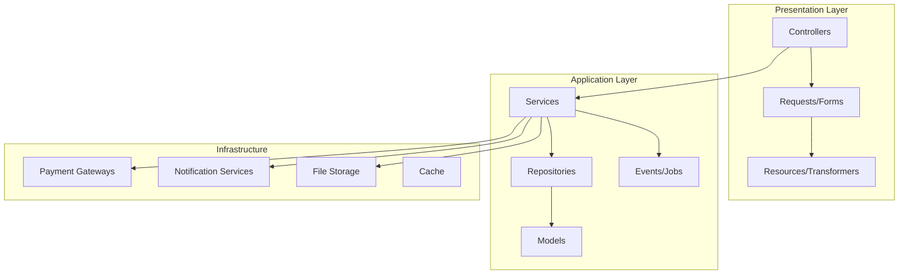

# Backend Architecture Improvement Plan

## Kiddo's Heaven Ecommerce - Backend & Admin Panel

---

## Current Codebase Analysis

### ✅ Strengths Found

- Clean Laravel 12 structure
- Well-organized models with proper relationships
- Good use of migrations with foreign keys
- Tailwind CSS for consistent UI
- Basic CRUD operations implemented

### ⚠️ Issues Identified

#### 1. **Code Structure Issues**

- Controllers contain business logic (should be in Services)
- No Form Request classes for validation
- Missing Repository pattern for database abstraction
- No Service layer for business logic
- Direct session usage in controllers (could be abstracted)

#### 2. **Backend Gaps**

- No Customer/User authentication for front-end
- No Order tracking system
- No Inventory management
- No Coupon/Promotion system
- No Email notification system
- No Report generation
- No Activity logging/Audit trail

#### 3. **Admin Panel Gaps**

- Missing Brands management
- Missing Customers management
- Missing Settings page
- No bulk operations
- No inventory alerts
- Limited dashboard analytics

---

## Recommended Backend Architecture



---

## Phase 1: Repository Pattern Implementation

### 1.1 Create Base Repository

**File:** [`app/Repositories/RepositoryInterface.php`](app/Repositories/RepositoryInterface.php)

```php
interface RepositoryInterface
{
    public function all(array $columns = ['*']);
    public function find(int $id);
    public function findBy(string $field, $value);
    public function create(array $data);
    public function update(int $id, array $data);
    public function delete(int $id);
    public function paginate(int $perPage = 15);
}
```

**File:** [`app/Repositories/BaseRepository.php`](app/Repositories/BaseRepository.php)

```php
abstract class BaseRepository implements RepositoryInterface
{
    protected Model $model;

    public function __construct(Model $model)
    {
        $this->model = $model;
    }

    // Implementation...
}
```

### 1.2 Create Specific Repositories

| Repository         | Purpose                | File                                                                                 |
| ------------------ | ---------------------- | ------------------------------------------------------------------------------------ |
| ProductRepository  | Product CRUD & queries | [`app/Repositories/ProductRepository.php`](app/Repositories/ProductRepository.php)   |
| OrderRepository    | Order management       | [`app/Repositories/OrderRepository.php`](app/Repositories/OrderRepository.php)       |
| CatalogRepository  | Category management    | [`app/Repositories/CatalogRepository.php`](app/Repositories/CatalogRepository.php)   |
| CustomerRepository | Customer operations    | [`app/Repositories/CustomerRepository.php`](app/Repositories/CustomerRepository.php) |

---

## Phase 2: Service Layer Implementation

### 2.1 Create Base Service

**File:** [`app/Services/BaseService.php`](app/Services/BaseService.php)

```php
abstract class BaseService
{
    protected RepositoryInterface $repository;

    public function __construct(RepositoryInterface $repository)
    {
        $this->repository = $repository;
    }
}
```

### 2.2 Create Domain Services

| Service             | Purpose                | Methods                                           |
| ------------------- | ---------------------- | ------------------------------------------------- |
| ProductService      | Product business logic | `getFeatured()`, `search()`, `updateStock()`      |
| OrderService        | Order workflow         | `processOrder()`, `updateStatus()`, `cancel()`    |
| CartService         | Cart operations        | `addItem()`, `removeItem()`, `applyCoupon()`      |
| PaymentService      | Payment processing     | `processPayment()`, `refund()`                    |
| InventoryService    | Stock management       | `checkStock()`, `deductStock()`, `restock()`      |
| NotificationService | Email/SMS sending      | `sendOrderConfirmation()`, `sendShipmentUpdate()` |

---

## Phase 3: Form Request Validation

### 3.1 Create Form Requests

| Request              | Purpose                   | File                                                                                       |
| -------------------- | ------------------------- | ------------------------------------------------------------------------------------------ |
| StoreProductRequest  | Validate product creation | [`app/Http/Requests/StoreProductRequest.php`](app/Http/Requests/StoreProductRequest.php)   |
| UpdateProductRequest | Validate product update   | [`app/Http/Requests/UpdateProductRequest.php`](app/Http/Requests/UpdateProductRequest.php) |
| StoreOrderRequest    | Validate order creation   | [`app/Http/Requests/StoreOrderRequest.php`](app/Http/Requests/StoreOrderRequest.php)       |
| CheckoutRequest      | Validate checkout data    | [`app/Http/Requests/CheckoutRequest.php`](app/Http/Requests/CheckoutRequest.php)           |

### Example Form Request Structure

```php
class StoreProductRequest extends FormRequest
{
    public function authorize(): bool
    {
        return auth()->check() && auth()->user()->isAdmin();
    }

    public function rules(): array
    {
        return [
            'name' => ['required', 'string', 'max:255'],
            'price' => ['required', 'numeric', 'min:0'],
            'catalog_id' => ['required', 'exists:catalogs,id'],
            // ... more rules
        ];
    }

    public function messages(): array
    {
        return [
            'name.required' => 'Product name is required',
            'price.numeric' => 'Price must be a number',
        ];
    }
}
```

---

## Phase 4: Admin Panel Enhancements

### 4.1 New Admin Controllers

| Controller          | Purpose               | File                                                                                                       |
| ------------------- | --------------------- | ---------------------------------------------------------------------------------------------------------- |
| BrandController     | Manage brands         | [`app/Http/Controllers/Admin/BrandController.php`](app/Http/Controllers/Admin/BrandController.php)         |
| CustomerController  | View/manage customers | [`app/Http/Controllers/Admin/CustomerController.php`](app/Http/Controllers/Admin/CustomerController.php)   |
| SettingController   | Site settings         | [`app/Http/Controllers/Admin/SettingController.php`](app/Http/Controllers/Admin/SettingController.php)     |
| ReportController    | Analytics & reports   | [`app/Http/Controllers/Admin/ReportController.php`](app/Http/Controllers/Admin/ReportController.php)       |
| InventoryController | Stock management      | [`app/Http/Controllers/Admin/InventoryController.php`](app/Http/Controllers/Admin/InventoryController.php) |
| CouponController    | Discount codes        | [`app/Http/Controllers/Admin/CouponController.php`](app/Http/Controllers/Admin/CouponController.php)       |

### 4.2 Admin Routes Structure

```php
// routes/admin.php

Route::middleware(['auth', 'admin'])->prefix('admin')->name('admin.')->group(function () {
    // Dashboard
    Route::get('/', [DashboardController::class, 'index'])->name('dashboard');

    // Catalog Management
    Route::resource('catalogs', CatalogController::class);
    Route::post('catalogs/reorder', [CatalogController::class, 'reorder'])->name('catalogs.reorder');

    // Product Management
    Route::resource('products', ProductController::class);
    Route::post('products/bulk-action', [ProductController::class, 'bulkAction'])->name('products.bulk-action');
    Route::get('products/export', [ProductController::class, 'export'])->name('products.export');
    Route::post('products/import', [ProductController::class, 'import'])->name('products.import');

    // Order Management
    Route::resource('orders', OrderController::class);
    Route::get('orders/{order}/invoice', [OrderController::class, 'invoice'])->name('orders.invoice');
    Route::post('orders/{order}/ship', [OrderController::class, 'ship'])->name('orders.ship');

    // Brand Management
    Route::resource('brands', BrandController::class);

    // Customer Management
    Route::resource('customers', CustomerController::class)->only(['index', 'show']);
    Route::get('customers/{customer}/orders', [CustomerController::class, 'orders'])->name('customers.orders');

    // Inventory
    Route::get('inventory', [InventoryController::class, 'index'])->name('inventory.index');
    Route::get('inventory/alerts', [InventoryController::class, 'alerts'])->name('inventory.alerts');

    // Coupons
    Resource::resource('coupons', CouponController::class);

    // Reports
    Route::get('reports/sales', [ReportController::class, 'sales'])->name('reports.sales');
    Route::get('reports/products', [ReportController::class, 'products'])->name('reports.products');
    Route::get('reports/customers', [ReportController::class, 'customers'])->name('reports.customers');

    // Settings
    Route::get('settings', [SettingController::class, 'edit'])->name('settings.edit');
    Route::put('settings', [SettingController::class, 'update'])->name('settings.update');
});
```

---

## Phase 5: Database Schema Improvements

### 5.1 New Tables Required

```sql
-- Customer addresses
CREATE TABLE addresses (
    id BIGINT UNSIGNED AUTO_INCREMENT PRIMARY KEY,
    user_id BIGINT UNSIGNED NOT NULL,
    type ENUM('shipping', 'billing') DEFAULT 'shipping',
    name VARCHAR(255),
    phone VARCHAR(50),
    address_line1 VARCHAR(255),
    address_line2 VARCHAR(255),
    city VARCHAR(100),
    district VARCHAR(100),
    postal_code VARCHAR(20),
    is_default BOOLEAN DEFAULT FALSE,
    created_at TIMESTAMP,
    updated_at TIMESTAMP,
    FOREIGN KEY (user_id) REFERENCES users(id) ON DELETE CASCADE
);

-- Coupons
CREATE TABLE coupons (
    id BIGINT UNSIGNED AUTO_INCREMENT PRIMARY KEY,
    code VARCHAR(50) UNIQUE NOT NULL,
    type ENUM('percentage', 'fixed', 'shipping') DEFAULT 'percentage',
    value DECIMAL(10,2) NOT NULL,
    min_order_amount DECIMAL(10,2),
    max_discount DECIMAL(10,2),
    usage_limit INT,
    used_count INT DEFAULT 0,
    valid_from TIMESTAMP,
    valid_until TIMESTAMP,
    status ENUM('active', 'inactive') DEFAULT 'active',
    created_at TIMESTAMP,
    updated_at TIMESTAMP
);

-- Coupon usage tracking
CREATE TABLE coupon_usages (
    id BIGINT UNSIGNED AUTO_INCREMENT PRIMARY KEY,
    coupon_id BIGINT UNSIGNED NOT NULL,
    user_id BIGINT UNSIGNED,
    order_id BIGINT UNSIGNED NOT NULL,
    discount_amount DECIMAL(10,2) NOT NULL,
    used_at TIMESTAMP DEFAULT CURRENT_TIMESTAMP,
    FOREIGN KEY (coupon_id) REFERENCES coupons(id) ON DELETE CASCADE,
    FOREIGN KEY (user_id) REFERENCES users(id) ON DELETE SET NULL,
    FOREIGN KEY (order_id) REFERENCES orders(id) ON DELETE CASCADE
);

-- Order status history
CREATE TABLE order_status_history (
    id BIGINT UNSIGNED AUTO_INCREMENT PRIMARY KEY,
    order_id BIGINT UNSIGNED NOT NULL,
    status VARCHAR(50) NOT NULL,
    note TEXT,
    created_by BIGINT UNSIGNED,
    created_at TIMESTAMP DEFAULT CURRENT_TIMESTAMP,
    FOREIGN KEY (order_id) REFERENCES orders(id) ON DELETE CASCADE,
    FOREIGN KEY (created_by) REFERENCES users(id) ON DELETE SET NULL
);

-- Wishlist
CREATE TABLE wishlists (
    id BIGINT UNSIGNED AUTO_INCREMENT PRIMARY KEY,
    user_id BIGINT UNSIGNED NOT NULL,
    product_id BIGINT UNSIGNED NOT NULL,
    created_at TIMESTAMP DEFAULT CURRENT_TIMESTAMP,
    FOREIGN KEY (user_id) REFERENCES users(id) ON DELETE CASCADE,
    FOREIGN KEY (product_id) REFERENCES products(id) ON DELETE CASCADE,
    UNIQUE KEY unique_wishlist (user_id, product_id)
);

-- Product reviews
CREATE TABLE reviews (
    id BIGINT UNSIGNED AUTO_INCREMENT PRIMARY KEY,
    user_id BIGINT UNSIGNED,
    product_id BIGINT UNSIGNED NOT NULL,
    rating TINYINT UNSIGNED CHECK (rating BETWEEN 1 AND 5),
    title VARCHAR(255),
    content TEXT,
    status ENUM('pending', 'approved', 'rejected') DEFAULT 'pending',
    created_at TIMESTAMP DEFAULT CURRENT_TIMESTAMP,
    updated_at TIMESTAMP,
    FOREIGN KEY (user_id) REFERENCES users(id) ON DELETE SET NULL,
    FOREIGN KEY (product_id) REFERENCES products(id) ON DELETE CASCADE
);

-- Site settings
CREATE TABLE settings (
    id INT UNSIGNED AUTO_INCREMENT PRIMARY KEY,
    `key` VARCHAR(255) UNIQUE NOT NULL,
    value TEXT,
    created_at TIMESTAMP,
    updated_at TIMESTAMP
);

-- Admin activity log
CREATE TABLE activity_logs (
    id BIGINT UNSIGNED AUTO_INCREMENT PRIMARY KEY,
    user_id BIGINT UNSIGNED NOT NULL,
    action VARCHAR(100) NOT NULL,
    model_type VARCHAR(100),
    model_id BIGINT UNSIGNED,
    old_values JSON,
    new_values JSON,
    ip_address VARCHAR(45),
    user_agent TEXT,
    created_at TIMESTAMP DEFAULT CURRENT_TIMESTAMP,
    FOREIGN KEY (user_id) REFERENCES users(id) ON DELETE CASCADE
);
```

### 5.2 Products Table Modifications

```sql
-- Add to products table
ALTER TABLE products ADD COLUMN low_stock_threshold INT DEFAULT 10 AFTER stock_quantity;
ALTER TABLE products ADD COLUMN barcode VARCHAR(100) AFTER sku;
ALTER TABLE products ADD COLUMN is_taxable BOOLEAN DEFAULT TRUE AFTER status;
ALTER TABLE products ADD COLUMN tax_class VARCHAR(50) AFTER is_taxable;
```

### 5.3 Orders Table Modifications

```sql
-- Add to orders table
ALTER TABLE orders ADD COLUMN order_number VARCHAR(50) UNIQUE AFTER id;
ALTER TABLE orders ADD COLUMN tracking_number VARCHAR(100) AFTER status;
ALTER TABLE orders ADD COLUMN shipped_at TIMESTAMP AFTER tracking_number;
ALTER TABLE orders ADD COLUMN delivered_at TIMESTAMP AFTER shipped_at;
ALTER TABLE orders ADD COLUMN cancelled_at TIMESTAMP AFTER delivered_at;
ALTER TABLE orders ADD COLUMN cancelled_reason TEXT AFTER cancelled_at;
ALTER TABLE orders ADD COLUMN payment_status ENUM('pending', 'paid', 'failed', 'refunded') DEFAULT 'pending';
ALTER TABLE orders ADD COLUMN payment_id VARCHAR(100) AFTER payment_status;
ALTER TABLE orders ADD COLUMN discount_amount DECIMAL(10,2) DEFAULT 0 AFTER total_amount;
ALTER TABLE orders ADD COLUMN shipping_amount DECIMAL(10,2) DEFAULT 0 AFTER discount_amount;
```

---

## Phase 6: Event System

### 6.1 Create Events

| Event              | Purpose                   | File                                                                     |
| ------------------ | ------------------------- | ------------------------------------------------------------------------ |
| OrderPlaced        | When order is created     | [`app/Events/OrderPlaced.php`](app/Events/OrderPlaced.php)               |
| OrderStatusChanged | When order status updates | [`app/Events/OrderStatusChanged.php`](app/Events/OrderStatusChanged.php) |
| ProductCreated     | New product added         | [`app/Events/ProductCreated.php`](app/Events/ProductCreated.php)         |
| LowStockAlert      | Stock below threshold     | [`app/Events/LowStockAlert.php`](app/Events/LowStockAlert.php)           |
| UserRegistered     | New customer signup       | [`app/Events/UserRegistered.php`](app/Events/UserRegistered.php)         |

### 6.2 Create Listeners

| Listener                 | Handles            | File                                                                                       |
| ------------------------ | ------------------ | ------------------------------------------------------------------------------------------ |
| SendOrderConfirmation    | OrderPlaced        | [`app/Listeners/SendOrderConfirmation.php`](app/Listeners/SendOrderConfirmation.php)       |
| UpdateOrderStatusHistory | OrderStatusChanged | [`app/Listeners/UpdateOrderStatusHistory.php`](app/Listeners/UpdateOrderStatusHistory.php) |
| DeductInventory          | OrderPlaced        | [`app/Listeners/DeductInventory.php`](app/Listeners/DeductInventory.php)                   |
| SendLowStockNotification | LowStockAlert      | [`app/Listeners/SendLowStockNotification.php`](app/Listeners/SendLowStockNotification.php) |

### 6.3 Event Service Provider

```php
// app/Providers/EventServiceProvider.php

protected $listen = [
    OrderPlaced::class => [
        SendOrderConfirmation::class,
        DeductInventory::class,
        UpdateOrderStatusHistory::class,
    ],
    OrderStatusChanged::class => [
        UpdateOrderStatusHistory::class,
        SendStatusUpdateNotification::class,
    ],
    LowStockAlert::class => [
        SendLowStockNotification::class,
    ],
];
```

---

## Phase 7: Job Queue System

### 7.1 Create Jobs

| Job             | Purpose                | File                                                           |
| --------------- | ---------------------- | -------------------------------------------------------------- |
| ProcessPayment  | Handle payment gateway | [`app/Jobs/ProcessPayment.php`](app/Jobs/ProcessPayment.php)   |
| SendEmail       | Queue emails           | [`app/Jobs/SendEmail.php`](app/Jobs/SendEmail.php)             |
| GenerateInvoice | Create PDF invoices    | [`app/Jobs/GenerateInvoice.php`](app/Jobs/GenerateInvoice.php) |
| SyncInventory   | Update stock levels    | [`app/Jobs/SyncInventory.php`](app/Jobs/SyncInventory.php)     |
| ExportProducts  | Generate CSV export    | [`app/Jobs/ExportProducts.php`](app/Jobs/ExportProducts.php)   |

---

## Phase 8: API Resources (Optional)

### 8.1 Create API Resources

| Resource        | Purpose              | File                                                                               |
| --------------- | -------------------- | ---------------------------------------------------------------------------------- |
| ProductResource | API product response | [`app/Http/Resources/ProductResource.php`](app/Http/Resources/ProductResource.php) |
| OrderResource   | API order response   | [`app/Http/Resources/OrderResource.php`](app/Http/Resources/OrderResource.php)     |
| CartResource    | API cart response    | [`app/Http/Resources/CartResource.php`](app/Http/Resources/CartResource.php)       |

---

## Implementation Priority

| Priority | Task                 | Effort | Impact |
| -------- | -------------------- | ------ | ------ |
| HIGH     | Repository Pattern   | 2 days | High   |
| HIGH     | Service Layer        | 3 days | High   |
| HIGH     | Form Requests        | 1 day  | Medium |
| HIGH     | Order Enhancements   | 2 days | High   |
| MEDIUM   | Inventory Management | 2 days | Medium |
| MEDIUM   | Customer Addresses   | 1 day  | Medium |
| MEDIUM   | Coupon System        | 2 days | Medium |
| LOW      | API Resources        | 1 day  | Low    |
| LOW      | Event System         | 2 days | Medium |

---

## File Structure After Improvements

```
app/
├── Console/
│   └── Commands/
│       ├── ExportProducts.php
│       └── ImportProducts.php
├── Events/
│   ├── OrderPlaced.php
│   ├── OrderStatusChanged.php
│   └── LowStockAlert.php
├── Exceptions/
│   └── Handler.php
├── Http/
│   ├── Controllers/
│   │   ├── Admin/
│   │   │   ├── DashboardController.php
│   │   │   ├── ProductController.php
│   │   │   ├── OrderController.php
│   │   │   ├── CatalogController.php
│   │   │   ├── BrandController.php
│   │   │   ├── CustomerController.php
│   │   │   ├── InventoryController.php
│   │   │   ├── CouponController.php
│   │   │   ├── ReportController.php
│   │   │   └── SettingController.php
│   │   ├── Shop/
│   │   │   ├── HomeController.php
│   │   │   ├── CatalogController.php
│   │   │   ├── ProductController.php
│   │   │   ├── CartController.php
│   │   │   └── CheckoutController.php
│   │   └── Auth/
│   │       ├── LoginController.php
│   │       ├── RegisterController.php
│   │       └── PasswordController.php
│   ├── Middleware/
│   │   ├── EnsureAdmin.php
│   │   └── ThrottleRequests.php
│   ├── Requests/
│   │   ├── FormRequest.php
│   │   ├── StoreProductRequest.php
│   │   ├── UpdateProductRequest.php
│   │   ├── StoreOrderRequest.php
│   │   └── CheckoutRequest.php
│   └── Resources/
│       ├── ProductResource.php
│       └── OrderResource.php
├── Jobs/
│   ├── ProcessPayment.php
│   ├── SendEmail.php
│   └── GenerateInvoice.php
├── Listeners/
│   ├── SendOrderConfirmation.php
│   ├── DeductInventory.php
│   └── UpdateOrderStatusHistory.php
├── Models/
│   ├── Product.php
│   ├── Order.php
│   ├── OrderItem.php
│   ├── Catalog.php
│   ├── Brand.php
│   ├── User.php
│   ├── Address.php
│   ├── Coupon.php
│   └── Review.php
├── Notifications/
│   ├── OrderConfirmation.php
│   └── OrderShipped.php
├── Providers/
│   ├── AppServiceProvider.php
│   ├── EventServiceProvider.php
│   └── RouteServiceProvider.php
├── Repositories/
│   ├── RepositoryInterface.php
│   ├── BaseRepository.php
│   ├── ProductRepository.php
│   ├── OrderRepository.php
│   ├── CatalogRepository.php
│   └── CustomerRepository.php
├── Services/
│   ├── BaseService.php
│   ├── ProductService.php
│   ├── OrderService.php
│   ├── CartService.php
│   ├── PaymentService.php
│   ├── InventoryService.php
│   └── NotificationService.php
└── Traits/
    └── HasActivityLog.php
```

---

## Next Steps

1. **Approve this plan** - Confirm which phases to implement
2. **Start with Phase 1** - Repository pattern implementation
3. **Phase 2** - Service layer refactoring
4. **Phase 3** - Form requests validation
5. **Phase 4** - Admin panel enhancements
6. **Database migrations** - Add new tables
7. **Testing** - Comprehensive testing after each phase
