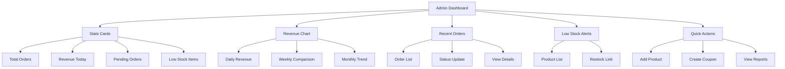

# Complete Ecommerce Improvement Plan

## Kiddo's Heaven - Backend, Frontend & Admin Theming

---

## Current State Analysis

### ✅ Strengths

- **Laravel 12** with modern PHP 8.2
- **Tailwind CSS 4.0** with custom color palette
- **Vite** for asset building
- Clean Blade templates
- Responsive design
- Good admin layout structure

### ⚠️ Areas Needing Improvement

#### Backend

- Controllers contain business logic
- No Repository pattern
- No Service layer
- Limited validation (inline in controllers)
- No Form Request classes
- Direct session usage

#### Admin Panel

- Missing Brand management
- Missing Customer management
- Missing Settings page
- No bulk operations
- No import/export
- Limited dashboard analytics
- No inventory alerts
- No activity logging

#### Frontend

- No customer authentication
- No search functionality
- No product filtering/sorting
- No wishlist
- No product reviews/ratings
- Only COD payment
- No order tracking
- No coupons/discounts
- Limited product detail page
- No customer account area

---

## Part 1: Backend Architecture

### 1.1 Repository Pattern

```
app/Repositories/
├── RepositoryInterface.php
├── BaseRepository.php
├── ProductRepository.php
├── OrderRepository.php
├── CatalogRepository.php
├── CustomerRepository.php
├── BrandRepository.php
└── CouponRepository.php
```

### 1.2 Service Layer

```
app/Services/
├── BaseService.php
├── ProductService.php
├── OrderService.php
├── CartService.php
├── PaymentService.php
├── InventoryService.php
├── NotificationService.php
└── CouponService.php
```

### 1.3 Form Requests

```
app/Http/Requests/
├── FormRequest.php (base)
├── StoreProductRequest.php
├── UpdateProductRequest.php
├── StoreOrderRequest.php
├── CheckoutRequest.php
├── StoreCatalogRequest.php
├── StoreBrandRequest.php
└── StoreCouponRequest.php
```

### 1.4 Events & Jobs

```
app/Events/
├── OrderPlaced.php
├── OrderStatusChanged.php
├── LowStockAlert.php
└── UserRegistered.php

app/Jobs/
├── ProcessPayment.php
├── SendEmail.php
├── GenerateInvoice.php
└── ExportProducts.php

app/Listeners/
├── SendOrderConfirmation.php
├── DeductInventory.php
├── UpdateOrderStatusHistory.php
└── SendLowStockNotification.php
```

---

## Part 2: Database Schema

### 2.1 New Tables

```sql
-- Customer Addresses
CREATE TABLE addresses (
    id BIGINT UNSIGNED AUTO_INCREMENT PRIMARY KEY,
    user_id BIGINT UNSIGNED NOT NULL,
    type ENUM('shipping', 'billing') DEFAULT 'shipping',
    name VARCHAR(255),
    phone VARCHAR(50),
    address_line1 VARCHAR(255),
    address_line2 VARCHAR(255),
    city VARCHAR(100),
    district VARCHAR(100),
    postal_code VARCHAR(20),
    is_default BOOLEAN DEFAULT FALSE,
    created_at TIMESTAMP,
    updated_at TIMESTAMP,
    FOREIGN KEY (user_id) REFERENCES users(id) ON DELETE CASCADE
);

-- Coupons
CREATE TABLE coupons (
    id BIGINT UNSIGNED AUTO_INCREMENT PRIMARY KEY,
    code VARCHAR(50) UNIQUE NOT NULL,
    description TEXT,
    type ENUM('percentage', 'fixed', 'shipping') DEFAULT 'percentage',
    value DECIMAL(10,2) NOT NULL,
    min_order_amount DECIMAL(10,2),
    max_discount DECIMAL(10,2),
    usage_limit INT,
    used_count INT DEFAULT 0,
    valid_from TIMESTAMP,
    valid_until TIMESTAMP,
    status ENUM('active', 'inactive') DEFAULT 'active',
    created_at TIMESTAMP,
    updated_at TIMESTAMP
);

-- Order Status History
CREATE TABLE order_status_history (
    id BIGINT UNSIGNED AUTO_INCREMENT PRIMARY KEY,
    order_id BIGINT UNSIGNED NOT NULL,
    status VARCHAR(50) NOT NULL,
    note TEXT,
    created_by BIGINT UNSIGNED,
    created_at TIMESTAMP DEFAULT CURRENT_TIMESTAMP,
    FOREIGN KEY (order_id) REFERENCES orders(id) ON DELETE CASCADE,
    FOREIGN KEY (created_by) REFERENCES users(id) ON DELETE SET NULL
);

-- Wishlist
CREATE TABLE wishlists (
    id BIGINT UNSIGNED AUTO_INCREMENT PRIMARY KEY,
    user_id BIGINT UNSIGNED NOT NULL,
    product_id BIGINT UNSIGNED NOT NULL,
    created_at TIMESTAMP DEFAULT CURRENT_TIMESTAMP,
    FOREIGN KEY (user_id) REFERENCES users(id) ON DELETE CASCADE,
    FOREIGN KEY (product_id) REFERENCES products(id) ON DELETE CASCADE,
    UNIQUE KEY unique_wishlist (user_id, product_id)
);

-- Reviews
CREATE TABLE reviews (
    id BIGINT UNSIGNED AUTO_INCREMENT PRIMARY KEY,
    user_id BIGINT UNSIGNED,
    product_id BIGINT UNSIGNED NOT NULL,
    rating TINYINT UNSIGNED CHECK (rating BETWEEN 1 AND 5),
    title VARCHAR(255),
    content TEXT,
    status ENUM('pending', 'approved', 'rejected') DEFAULT 'pending',
    created_at TIMESTAMP DEFAULT CURRENT_TIMESTAMP,
    updated_at TIMESTAMP,
    FOREIGN KEY (user_id) REFERENCES users(id) ON DELETE SET NULL,
    FOREIGN KEY (product_id) REFERENCES products(id) ON DELETE CASCADE
);

-- Activity Logs
CREATE TABLE activity_logs (
    id BIGINT UNSIGNED AUTO_INCREMENT PRIMARY KEY,
    user_id BIGINT UNSIGNED NOT NULL,
    action VARCHAR(100) NOT NULL,
    model_type VARCHAR(100),
    model_id BIGINT UNSIGNED,
    old_values JSON,
    new_values JSON,
    ip_address VARCHAR(45),
    user_agent TEXT,
    created_at TIMESTAMP DEFAULT CURRENT_TIMESTAMP,
    FOREIGN KEY (user_id) REFERENCES users(id) ON DELETE CASCADE
);

-- Settings Table
CREATE TABLE settings (
    id INT UNSIGNED AUTO_INCREMENT PRIMARY KEY,
    `key` VARCHAR(255) UNIQUE NOT NULL,
    value TEXT,
    created_at TIMESTAMP,
    updated_at TIMESTAMP
);
```

### 2.2 Orders Table Modifications

```sql
ALTER TABLE orders ADD COLUMN order_number VARCHAR(50) UNIQUE AFTER id;
ALTER TABLE orders ADD COLUMN tracking_number VARCHAR(100) AFTER status;
ALTER TABLE orders ADD COLUMN shipped_at TIMESTAMP AFTER tracking_number;
ALTER TABLE orders ADD COLUMN delivered_at TIMESTAMP AFTER shipped_at;
ALTER TABLE orders ADD COLUMN payment_status ENUM('pending', 'paid', 'failed', 'refunded') DEFAULT 'pending';
ALTER TABLE orders ADD COLUMN payment_id VARCHAR(100) AFTER payment_status;
ALTER TABLE orders ADD COLUMN discount_amount DECIMAL(10,2) DEFAULT 0 AFTER total_amount;
ALTER TABLE orders ADD COLUMN shipping_amount DECIMAL(10,2) DEFAULT 0 AFTER discount_amount;
```

### 2.3 Products Table Modifications

```sql
ALTER TABLE products ADD COLUMN low_stock_threshold INT DEFAULT 10 AFTER stock_quantity;
ALTER TABLE products ADD COLUMN barcode VARCHAR(100) AFTER sku;
ALTER TABLE products ADD COLUMN is_taxable BOOLEAN DEFAULT TRUE AFTER status;
```

---

## Part 3: Admin Panel Improvements

### 3.1 New Admin Controllers

| Controller          | Purpose               | Routes                     |
| ------------------- | --------------------- | -------------------------- |
| BrandController     | Manage brands         | CRUD operations            |
| CustomerController  | View/manage customers | Index, Show, Orders        |
| InventoryController | Stock management      | Index, Alerts              |
| CouponController    | Discount codes        | CRUD, Toggle status        |
| ReportController    | Analytics             | Sales, Products, Customers |
| SettingController   | Site settings         | Edit, Update               |
| MediaController     | Image management      | Upload, Delete             |

### 3.2 Admin Routes Structure

```php
// routes/admin.php

Route::middleware(['auth', 'admin'])->prefix('admin')->name('admin.')->group(function () {
    // Dashboard
    Route::get('/', [DashboardController::class, 'index'])->name('dashboard');

    // Catalog Management
    Route::resource('catalogs', CatalogController::class);
    Route::post('catalogs/reorder', [CatalogController::class, 'reorder'])->name('catalogs.reorder');

    // Product Management
    Route::resource('products', ProductController::class);
    Route::post('products/bulk-action', [ProductController::class, 'bulkAction'])->name('products.bulk-action');
    Route::get('products/export', [ProductController::class, 'export'])->name('products.export');
    Route::post('products/import', [ProductController::class, 'import'])->name('products.import');
    Route::get('products/{product}/duplicate', [ProductController::class, 'duplicate'])->name('products.duplicate');

    // Order Management
    Route::resource('orders', OrderController::class);
    Route::get('orders/{order}/invoice', [OrderController::class, 'invoice'])->name('orders.invoice');
    Route::post('orders/{order}/ship', [OrderController::class, 'ship'])->name('orders.ship');
    Route::post('orders/{order}/cancel', [OrderController::class, 'cancel'])->name('orders.cancel');

    // Brand Management
    Route::resource('brands', BrandController::class);

    // Customer Management
    Route::resource('customers', CustomerController::class)->only(['index', 'show']);
    Route::get('customers/{customer}/orders', [CustomerController::class, 'orders'])->name('customers.orders');
    Route::post('customers/{customer}/block', [CustomerController::class, 'block'])->name('customers.block');

    // Inventory
    Route::get('inventory', [InventoryController::class, 'index'])->name('inventory.index');
    Route::get('inventory/alerts', [InventoryController::class, 'alerts'])->name('inventory.alerts');
    Route::post('inventory/update', [InventoryController::class, 'update'])->name('inventory.update');

    // Coupons
    Route::resource('coupons', CouponController::class);

    // Reports
    Route::prefix('reports')->name('reports.')->group(function () {
        Route::get('sales', [ReportController::class, 'sales'])->name('sales');
        Route::get('products', [ReportController::class, 'products'])->name('products');
        Route::get('customers', [ReportController::class, 'customers'])->name('customers');
        Route::get('inventory', [ReportController::class, 'inventory'])->name('inventory');
        Route::get('export/{type}', [ReportController::class, 'export'])->name('export');
    });

    // Settings
    Route::get('settings', [SettingController::class, 'edit'])->name('settings.edit');
    Route::put('settings', [SettingController::class, 'update'])->name('settings.update');

    // Media Library
    Route::get('media', [MediaController::class, 'index'])->name('media.index');
    Route::post('media/upload', [MediaController::class, 'upload'])->name('media.upload');
    Route::delete('media/{media}', [MediaController::class, 'destroy'])->name('media.destroy');

    // Activity Log
    Route::get('activity', [ActivityLogController::class, 'index'])->name('activity.index');
});
```

### 3.3 Admin Dashboard Improvements



### 3.4 Admin UI Components to Create

```
resources/views/components/admin/
├── stat-card.blade.php
├── data-table.blade.php
├── filter-bar.blade.php
├── bulk-actions.blade.php
├── modal.blade.php
├── alert.blade.php
├── badge.blade.php
├── form-group.blade.php
├── input.blade.php
├── select.blade.php
├── textarea.blade.php
├── checkbox.blade.php
├── radio.blade.php
├── toggle.blade.php
├── pagination.blade.php
├── dropdown.blade.php
├── tabs.blade.php
├── breadcrumb.blade.php
├── sidebar.blade.php
├── header.blade.php
└── footer.blade.php
```

---

## Part 4: Frontend Improvements

### 4.1 New Frontend Pages

| Page              | Purpose             | File                                                                  |
| ----------------- | ------------------- | --------------------------------------------------------------------- |
| Customer Login    | User authentication | [`login.blade.php`](resources/views/auth/login.blade.php)             |
| Customer Register | New user signup     | [`register.blade.php`](resources/views/auth/register.blade.php)       |
| My Account        | Customer dashboard  | [`account.blade.php`](resources/views/customer/account.blade.php)     |
| Order History     | View past orders    | [`orders.blade.php`](resources/views/customer/orders.blade.php)       |
| Order Detail      | Single order view   | [`order.blade.php`](resources/views/customer/order.blade.php)         |
| Address Book      | Manage addresses    | [`addresses.blade.php`](resources/views/customer/addresses.blade.php) |
| Wishlist          | Saved products      | [`wishlist.blade.php`](resources/views/customer/wishlist.blade.php)   |
| Search Results    | Product search      | [`search.blade.php`](resources/views/shop/search.blade.php)           |
| Order Tracking    | Track order status  | [`tracking.blade.php`](resources/views/shop/tracking.blade.php)       |

### 4.2 Frontend Route Structure

```php
// routes/web.php

// Public routes
Route::get('/', [HomeController::class, 'index'])->name('home');
Route::get('/catalog', [CatalogController::class, 'index'])->name('catalog');
Route::get('/catalog/{catalog}', [CatalogController::class, 'show'])->name('catalog.show');
Route::get('/products/{product:slug}', [ProductController::class, 'show'])->name('products.show');
Route::get('/search', [SearchController::class, 'index'])->name('search');
Route::get('/track-order', [OrderTrackingController::class, 'show'])->name('track.order');

// Cart
Route::get('/cart', [CartController::class, 'index'])->name('cart.index');
Route::post('/cart/add/{product:slug}', [CartController::class, 'add'])->name('cart.add');
Route::post('/cart/update/{productId}', [CartController::class, 'update'])->name('cart.update');
Route::post('/cart/remove/{productId}', [CartController::class, 'remove'])->name('cart.remove');
Route::post('/cart/apply-coupon', [CartController::class, 'applyCoupon'])->name('cart.apply-coupon');
Route::post('/cart/remove-coupon', [CartController::class, 'removeCoupon'])->name('cart.remove-coupon');
Route::post('/cart/clear', [CartController::class, 'clear'])->name('cart.clear');

// Checkout
Route::get('/checkout', [CheckoutController::class, 'show'])->name('checkout.show');
Route::post('/checkout', [CheckoutController::class, 'placeOrder'])->name('checkout.place');
Route::get('/checkout/thank-you/{order}', [CheckoutController::class, 'thankYou'])->name('checkout.thankyou');
Route::get('/checkout/payment/{order}', [CheckoutController::class, 'payment'])->name('checkout.payment');

// Customer Authentication
Route::middleware('guest')->group(function () {
    Route::get('/login', [LoginController::class, 'showLoginForm'])->name('login');
    Route::post('/login', [LoginController::class, 'login']);
    Route::get('/register', [RegisterController::class, 'showRegistrationForm'])->name('register');
    Route::post('/register', [RegisterController::class, 'register']);
    Route::get('/forgot-password', [ForgotPasswordController::class, 'showLinkRequestForm'])->name('password.request');
    Route::post('/forgot-password', [ForgotPasswordController::class, 'sendResetLinkEmail'])->name('password.email');
    Route::get('/reset-password/{token}', [ResetPasswordController::class, 'showResetForm'])->name('password.reset');
    Route::post('/reset-password', [ResetPasswordController::class, 'reset'])->name('password.update');
});

Route::middleware('auth')->group(function () {
    Route::get('/account', [AccountController::class, 'index'])->name('account.index');
    Route::put('/account', [AccountController::class, 'update'])->name('account.update');
    Route::get('/orders', [OrderController::class, 'index'])->name('orders.index');
    Route::get('/orders/{order}', [OrderController::class, 'show'])->name('orders.show');
    Route::post('/orders/{order}/cancel', [OrderController::class, 'cancel'])->name('orders.cancel');
    Route::get('/addresses', [AddressController::class, 'index'])->name('addresses.index');
    Route::post('/addresses', [AddressController::class, 'store'])->name('addresses.store');
    Route::put('/addresses/{address}', [AddressController::class, 'update'])->name('addresses.update');
    Route::delete('/addresses/{address}', [AddressController::class, 'destroy'])->name('addresses.destroy');
    Route::post('/addresses/{address}/default', [AddressController::class, 'setDefault'])->name('addresses.default');
    Route::get('/wishlist', [WishlistController::class, 'index'])->name('wishlist.index');
    Route::post('/wishlist/{product}', [WishlistController::class, 'add'])->name('wishlist.add');
    Route::delete('/wishlist/{product}', [WishlistController::class, 'remove'])->name('wishlist.remove');
    Route::post('/logout', [LoginController::class, 'logout'])->name('logout');
});

// Static pages
Route::view('/about', 'about')->name('about');
Route::view('/contact', 'contact')->name('contact');
Route::post('/contact', [ContactController::class, 'send'])->name('contact.send');

// Admin (already defined in routes/admin.php)
```

### 4.3 Frontend Components

```
resources/views/components/
├── layout/
│   ├── header.blade.php
│   ├── footer.blade.php
│   ├── nav.blade.php
│   └── sidebar.blade.php
├── shop/
│   ├── product-card.blade.php
│   ├── product-grid.blade.php
│   ├── category-filter.blade.php
│   ├── price-filter.blade.php
│   ├── sort-dropdown.blade.php
│   ├── pagination.blade.php
│   ├── breadcrumb.blade.php
│   ├── quantity-selector.blade.php
│   ├── add-to-cart.blade.php
│   ├── wishlist-button.blade.php
│   ├── share-button.blade.php
│   ├── product-gallery.blade.php
│   ├── product-info.blade.php
│   ├── product-tabs.blade.php
│   ├── related-products.blade.php
│   └── recently-viewed.blade.php
├── cart/
│   ├── cart-item.blade.php
│   ├── cart-summary.blade.php
│   ├── coupon-form.blade.php
│   └── mini-cart.blade.php
├── checkout/
│   ├── address-form.blade.php
│   ├── payment-method.blade.php
│   ├── order-summary.blade.php
│   └── shipping-options.blade.php
├── customer/
│   ├── profile-form.blade.php
│   ├── address-card.blade.php
│   ├── address-form.blade.php
│   ├── order-card.blade.php
│   └── order-detail.blade.php
└── ui/
    ├── button.blade.php
    ├── input.blade.php
    ├── select.blade.php
    ├── textarea.blade.php
    ├── checkbox.blade.php
    ├── radio.blade.php
    ├── toggle.blade.php
    ├── modal.blade.php
    ├── alert.blade.php
    ├── badge.blade.php
    ├── card.blade.php
    ├── avatar.blade.php
    ├── dropdown.blade.php
    ├── tabs.blade.php
    ├── accordion.blade.php
    ├── tooltip.blade.php
    └── loader.blade.php
```

---

## Part 5: Theming System

### 5.1 Color Palette (Already Defined)

```css
/* Primary Colors */
--color-primary-dark: #005461;
--color-primary: #018790;
--color-primary-light: #02a5a4;

/* Accent Colors */
--color-accent: #00b7b5;
--color-accent-light: #00d4d2;

/* Neutral Colors */
--color-light: #f4f4f4;
--color-gray-50: #f9fafb;
--color-gray-100: #f3f4f6;
--color-gray-200: #e5e7eb;
--color-gray-300: #d1d5db;
--color-gray-400: #9ca3af;
--color-gray-500: #6b7280;
--color-gray-600: #4b5563;
--color-gray-700: #374151;
--color-gray-800: #1f2937;
--color-gray-900: #111827;

/* Status Colors */
--color-success: #10b981;
--color-warning: #f59e0b;
--color-danger: #dc2626;
--color-info: #3b82f6;
```

### 5.2 Typography

```css
/* Font families */
--font-sans: "Instrument Sans", ui-sans-serif, system-ui, sans-serif;
--font-display: "Baloo 2", cursive;

/* Font sizes */
--text-xs: 0.75rem;
--text-sm: 0.875rem;
--text-base: 1rem;
--text-lg: 1.125rem;
--text-xl: 1.25rem;
--text-2xl: 1.5rem;
--text-3xl: 1.875rem;
--text-4xl: 2.25rem;
```

### 5.3 Spacing

```css
--spacing-1: 0.25rem;
--spacing-2: 0.5rem;
--spacing-3: 0.75rem;
--spacing-4: 1rem;
--spacing-5: 1.25rem;
--spacing-6: 1.5rem;
--spacing-8: 2rem;
--spacing-10: 2.5rem;
--spacing-12: 3rem;
--spacing-16: 4rem;
```

### 5.4 Shadows

```css
--shadow-sm: 0 1px 2px 0 rgb(0 0 0 / 0.05);
--shadow: 0 1px 3px 0 rgb(0 0 0 / 0.1), 0 1px 2px -1px rgb(0 0 0 / 0.1);
--shadow-md: 0 4px 6px -1px rgb(0 0 0 / 0.1), 0 2px 4px -2px rgb(0 0 0 / 0.1);
--shadow-lg: 0 10px 15px -3px rgb(0 0 0 / 0.1), 0 4px 6px -4px rgb(0 0 0 / 0.1);
--shadow-xl:
    0 20px 25px -5px rgb(0 0 0 / 0.1), 0 8px 10px -6px rgb(0 0 0 / 0.1);
```

### 5.5 Border Radius

```css
--radius-sm: 0.25rem;
--radius: 0.375rem;
--radius-md: 0.5rem;
--radius-lg: 0.75rem;
--radius-xl: 1rem;
--radius-2xl: 1.5rem;
--radius-full: 9999px;
```

---

## Part 6: Implementation Priority

### Phase 1: Backend Foundation (Week 1)

| Task                | Effort | Priority |
| ------------------- | ------ | -------- |
| Repository Pattern  | 2 days | HIGH     |
| Service Layer       | 3 days | HIGH     |
| Form Requests       | 1 day  | HIGH     |
| Database Migrations | 1 day  | HIGH     |

### Phase 2: Admin Panel (Week 2)

| Task                | Effort | Priority |
| ------------------- | ------ | -------- |
| Brand Management    | 1 day  | MEDIUM   |
| Customer Management | 1 day  | MEDIUM   |
| Inventory System    | 2 days | HIGH     |
| Coupon System       | 2 days | MEDIUM   |
| Settings Page       | 1 day  | LOW      |

### Phase 3: Customer Features (Week 3)

| Task                | Effort | Priority |
| ------------------- | ------ | -------- |
| User Authentication | 2 days | HIGH     |
| Customer Dashboard  | 1 day  | HIGH     |
| Order History       | 1 day  | HIGH     |
| Address Book        | 1 day  | MEDIUM   |
| Wishlist            | 1 day  | MEDIUM   |

### Phase 4: Frontend Improvements (Week 4)

| Task                  | Effort | Priority |
| --------------------- | ------ | -------- |
| Search Functionality  | 1 day  | HIGH     |
| Order Tracking        | 1 day  | HIGH     |
| Reviews System        | 2 days | MEDIUM   |
| Checkout Enhancements | 2 days | HIGH     |

### Phase 5: Polish & Optimization (Week 5)

| Task               | Effort | Priority |
| ------------------ | ------ | -------- |
| Activity Logging   | 1 day  | MEDIUM   |
| Report Generation  | 2 days | MEDIUM   |
| Performance Tuning | 1 day  | MEDIUM   |
| Testing            | 2 days | HIGH     |

---

## File Structure Summary

```
app/
├── Console/Commands/
├── Events/
├── Exceptions/
├── Http/
│   ├── Controllers/
│   │   ├── Admin/
│   │   ├── Auth/
│   │   ├── Customer/
│   │   └── Shop/
│   ├── Middleware/
│   ├── Requests/
│   └── Resources/
├── Jobs/
├── Listeners/
├── Models/
├── Notifications/
├── Providers/
├── Repositories/
├── Services/
└── Traits/

resources/views/
├── admin/
│   ├── layouts/
│   ├── components/
│   ├── catalogs/
│   ├── products/
│   ├── orders/
│   ├── brands/
│   ├── customers/
│   ├── inventory/
│   ├── coupons/
│   ├── reports/
│   └── settings/
├── auth/
├── customer/
│   ├── account/
│   ├── orders/
│   ├── addresses/
│   └── wishlist/
├── shop/
│   ├── components/
│   ├── catalog.blade.php
│   ├── product.blade.php
│   ├── cart.blade.php
│   ├── checkout.blade.php
│   ├── search.blade.php
│   └── tracking.blade.php
├── components/
│   ├── layout/
│   ├── shop/
│   ├── cart/
│   ├── checkout/
│   ├── customer/
│   └── ui/
└── layouts/
    ├── app.blade.php
    └── admin.blade.php

routes/
├── web.php
├── admin.php
└── api.php (optional)
```

---

## Next Steps

1. **Approve this plan** - Confirm implementation order
2. **Phase 1: Backend Foundation**
    - Create Repository pattern
    - Create Service layer
    - Create Form Requests
    - Run database migrations
3. **Phase 2: Admin Panel**
    - Add new admin controllers
    - Create admin views/components
    - Add bulk operations
4. **Phase 3: Customer Features**
    - Implement authentication
    - Create customer dashboard
5. **Phase 4: Frontend**
    - Add search/filter
    - Order tracking
    - Reviews system
6. **Phase 5: Polish**
    - Testing
    - Documentation
