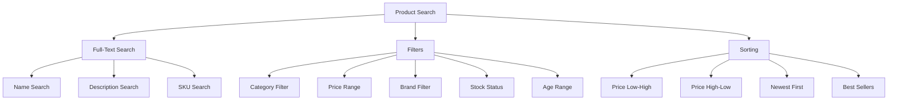
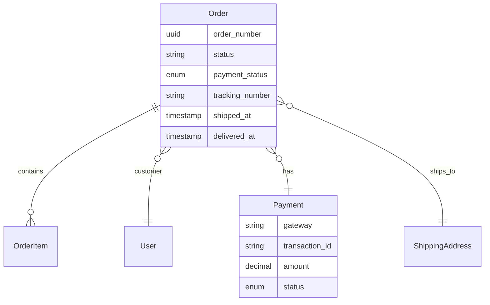
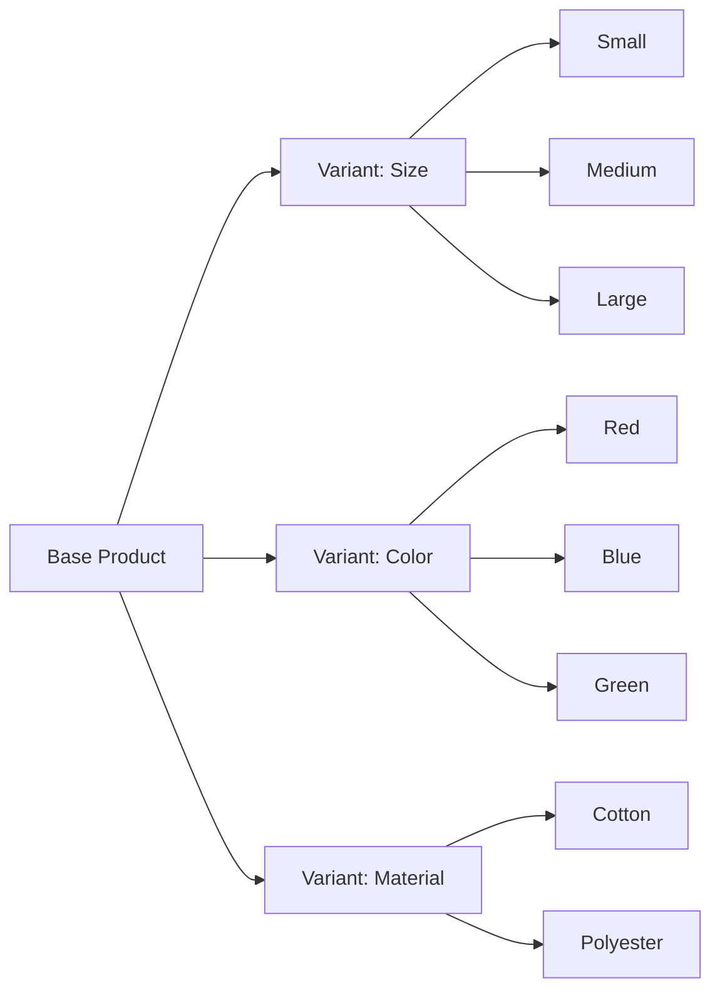

# Kiddo's Heaven Ecommerce - Comprehensive Improvement Plan

## Executive Summary

Your Laravel-based ecommerce application ("Kiddo's Heaven") has a solid foundation with well-structured models, clean controllers, and a modern Tailwind CSS frontend. This plan outlines essential improvements to transform it into a fully-featured, production-ready ecommerce platform.

---

## Phase 1: Core Infrastructure & User Experience

### 1.1 Customer Authentication System

**Priority: HIGH**

| Feature               | Description                            | Files to Create/Modify                                                                                                                    |
| --------------------- | -------------------------------------- | ----------------------------------------------------------------------------------------------------------------------------------------- |
| Customer Registration | User signup with email verification    | [`RegisterController`](app/Http/Controllers/Auth/RegisterController.php), [`register.blade.php`](resources/views/auth/register.blade.php) |
| Customer Login        | Secure login with "Remember Me"        | [`LoginController.php`](app/Http/Controllers/Auth/LoginController.php) - extend for customers                                             |
| Password Reset        | Email-based password recovery          | [`ForgotPasswordController`](app/Http/Controllers/Auth/ForgotPasswordController.php)                                                      |
| Email Verification    | Verify email before account activation | [`VerifyEmailController`](app/Http/Controllers/Auth/VerifyEmailController.php)                                                            |
| Customer Profile      | Manage address, phone, preferences     | [`ProfileController`](app/Http/Controllers/Customer/ProfileController.php)                                                                |

**Benefits:**

- Personalized shopping experience
- Order history access
- Faster checkout for returning customers
- Address book for multiple shipping locations

### 1.2 Enhanced Cart & Checkout

**Priority: HIGH**

| Feature             | Description                                | Implementation                                                             |
| ------------------- | ------------------------------------------ | -------------------------------------------------------------------------- |
| Persistent Cart     | Save cart to database for logged-in users  | Modify [`CartController`](app/Http/Controllers/CartController.php)         |
| AJAX Cart Updates   | Real-time cart updates without page reload | Add JavaScript/XHR handlers                                                |
| Cart Save for Later | Save items without purchasing              | New `SavedItem` model and functionality                                    |
| Mini Cart           | Quick cart preview in header               | Update [`app.blade.php`](resources/views/layouts/app.blade.php)            |
| Guest Checkout      | Allow checkout without registration        | Extend [`CheckoutController`](app/Http/Controllers/CheckoutController.php) |

### 1.3 Product Search & Filtering

**Priority: HIGH**



**Implementation:**

- Add [`SearchController`](app/Http/Controllers/SearchController.php)
- Create search index using Laravel Scout or database FULLTEXT
- Add filter sidebar to [`catalog.blade.php`](resources/views/shop/catalog.blade.php)

---

## Phase 2: Payments & Orders

### 2.1 Multiple Payment Methods

**Priority: HIGH**

| Payment Method     | Description                          | Integration                  |
| ------------------ | ------------------------------------ | ---------------------------- |
| bKash              | Popular mobile banking in Bangladesh | bKash Payment Gateway API    |
| Nagad              | Another popular mobile banking       | Nagad Payment Gateway API    |
| Rocket             | Bank-based mobile finance            | Rocket API                   |
| Credit/Debit Cards | Visa, Mastercard, Amex               | Stripe or SSLCommerz         |
| Bank Transfer      | Direct bank deposit                  | Manual verification workflow |

**Files to Create:**

- [`PaymentController`](app/Http/Controllers/PaymentController.php)
- [`PaymentService`](app/Services/PaymentService.php)
- Payment gateway integration classes

### 2.2 Enhanced Order Management

**Priority: HIGH**



**Features to Add:**

1. **Order Number Generation** - Human-readable order IDs (e.g., KH-2024-0001)
2. **Order Status Workflow** - pending → confirmed → processing → shipped → delivered
3. **Payment Status** - pending → paid → failed → refunded
4. **Order Tracking** - Customer-facing tracking page
5. **Order History** - Customer account order history
6. **Order Cancellation** - Self-service cancellation with refund workflow
7. **Order Invoice PDF** - Downloadable invoices

### 2.3 Shipping Management

**Priority: MEDIUM**

| Feature            | Description                                 |
| ------------------ | ------------------------------------------- |
| Shipping Zones     | Define regions with different rates         |
| Shipping Methods   | Standard, Express, Free shipping thresholds |
| Delivery Estimates | Show estimated delivery dates               |
| Order Tracking     | Integration with delivery partners          |

---

## Phase 3: Product Enhancements

### 3.1 Product Variants

**Priority: MEDIUM**



**Database Changes:**

- Create [`ProductVariant`](app/Models/ProductVariant.php) model
- Create [`ProductOption`](app/Models/ProductOption.php) model (size, color, etc.)
- Create [`ProductOptionValue`](app/Models/ProductOptionValue.php) model

### 3.2 Product Reviews & Ratings

**Priority: MEDIUM**

| Feature           | Description                          |
| ----------------- | ------------------------------------ |
| Star Ratings      | 1-5 star product ratings             |
| Customer Reviews  | Written reviews with photos          |
| Review Moderation | Admin-approved reviews               |
| Q&A Section       | Customer questions and answers       |
| Average Rating    | Display aggregate rating on products |

### 3.3 Wishlist

**Priority: MEDIUM**

| Feature        | Description                           |
| -------------- | ------------------------------------- |
| Save Products  | Add products to wishlist              |
| Wishlist Page  | View saved products                   |
| Price Alerts   | Notify when wishlist items go on sale |
| Share Wishlist | Share via social media or link        |

---

## Phase 4: Marketing & Promotions

### 4.1 Coupon System

**Priority: MEDIUM**

| Coupon Type    | Description            | Example          |
| -------------- | ---------------------- | ---------------- |
| Percentage Off | Discount by percentage | 10% off          |
| Fixed Amount   | Fixed discount         | ৳500 off         |
| Free Shipping  | No shipping charge     | Free delivery    |
| BOGO           | Buy one get one        | Buy 2 get 1 free |
| Minimum Order  | Minimum cart value     | ৳2000 minimum    |

### 4.2 Newsletter & Email Marketing

**Priority: LOW**

| Feature            | Description                   |
| ------------------ | ----------------------------- |
| Newsletter Signup  | Email subscription form       |
| Welcome Emails     | Automated welcome series      |
| Order Confirmation | Order received emails         |
| Shipping Updates   | Tracking number notifications |
| Promotional Emails | Sales and new arrivals        |

---

## Phase 5: Admin Dashboard Enhancements

### 5.1 Advanced Admin Features

**Priority: HIGH**

| Feature              | Description                      |
| -------------------- | -------------------------------- |
| Dashboard Analytics  | Sales charts, revenue metrics    |
| Order Management     | Bulk order status updates        |
| Inventory Management | Stock tracking and alerts        |
| Customer Management  | Customer list and details        |
| Reports & Analytics  | Sales, product, customer reports |
| Bulk Operations      | Bulk product import/export       |
| System Settings      | Configure store settings         |

### 5.2 Admin Dashboard Pages


---

## Phase 6: Technical Improvements

### 6.1 Performance Optimization

**Priority: MEDIUM**

| Optimization       | Description                     |
| ------------------ | ------------------------------- |
| Image Optimization | Compress and lazy-load images   |
| Caching            | Implement Redis or file caching |
| Database Indexing  | Optimize query performance      |
| CDN Integration    | Serve static assets via CDN     |
| Code Optimization  | Minify CSS/JS in production     |

### 6.2 SEO Enhancements

**Priority: MEDIUM**

| Feature         | Description                      |
| --------------- | -------------------------------- |
| Structured Data | Product schema markup            |
| Sitemap         | XML sitemap generation           |
| Robots.txt      | Search engine rules              |
| Canonical URLs  | Prevent duplicate content        |
| Open Graph      | Social media previews            |
| Meta Tags       | Dynamic meta titles/descriptions |

### 6.3 Security Improvements

**Priority: HIGH**

| Feature          | Description                  |
| ---------------- | ---------------------------- |
| HTTPS            | SSL certificate enforcement  |
| CSRF Protection  | Already implemented, verify  |
| XSS Protection   | Content sanitization         |
| SQL Injection    | Already protected by Laravel |
| Rate Limiting    | Prevent brute force attacks  |
| Input Validation | Server-side validation       |
| Security Headers | X-Frame-Options, CSP         |

---

## Phase 7: Analytics & Tracking

### 7.1 Analytics Integration

**Priority: LOW**

| Tool               | Purpose                   |
| ------------------ | ------------------------- |
| Google Analytics   | Traffic and user behavior |
| Google Tag Manager | Event tracking            |
| Facebook Pixel     | Ad conversion tracking    |
| Hotjar             | User behavior heatmaps    |

---

## Implementation Priority Matrix

| Phase | Priority | Effort | Impact | Items                       |
| ----- | -------- | ------ | ------ | --------------------------- |
| 1     | HIGH     | High   | High   | Customer Auth, Search, Cart |
| 2     | HIGH     | High   | High   | Payments, Order Management  |
| 3     | MEDIUM   | Medium | Medium | Variants, Reviews, Wishlist |
| 4     | MEDIUM   | Low    | Medium | Coupons, Newsletter         |
| 5     | HIGH     | High   | High   | Admin Dashboard, Analytics  |
| 6     | MEDIUM   | Medium | Medium | Performance, SEO, Security  |
| 7     | LOW      | Low    | Low    | Analytics Integration       |

---

## Database Schema Updates Required

### New Tables

```sql
-- Customer addresses
CREATE TABLE addresses (
    id BIGINT UNSIGNED AUTO_INCREMENT PRIMARY KEY,
    user_id BIGINT UNSIGNED NOT NULL,
    type ENUM('shipping', 'billing') DEFAULT 'shipping',
    name VARCHAR(255),
    phone VARCHAR(50),
    address_line1 VARCHAR(255),
    address_line2 VARCHAR(255),
    city VARCHAR(100),
    district VARCHAR(100),
    postal_code VARCHAR(20),
    is_default BOOLEAN DEFAULT FALSE,
    created_at TIMESTAMP,
    updated_at TIMESTAMP
);

-- Wishlist
CREATE TABLE wishlists (
    id BIGINT UNSIGNED AUTO_INCREMENT PRIMARY KEY,
    user_id BIGINT UNSIGNED NOT NULL,
    product_id BIGINT UNSIGNED NOT NULL,
    created_at TIMESTAMP
);

-- Product reviews
CREATE TABLE reviews (
    id BIGINT UNSIGNED AUTO_INCREMENT PRIMARY KEY,
    user_id BIGINT UNSIGNED,
    product_id BIGINT UNSIGNED NOT NULL,
    rating TINYINT UNSIGNED CHECK (rating BETWEEN 1 AND 5),
    title VARCHAR(255),
    content TEXT,
    status ENUM('pending', 'approved', 'rejected') DEFAULT 'pending',
    created_at TIMESTAMP
);

-- Coupons
CREATE TABLE coupons (
    id BIGINT UNSIGNED AUTO_INCREMENT PRIMARY KEY,
    code VARCHAR(50) UNIQUE,
    type ENUM('percentage', 'fixed', 'shipping') DEFAULT 'percentage',
    value DECIMAL(10,2),
    min_order_amount DECIMAL(10,2),
    max_discount DECIMAL(10,2),
    usage_limit INT,
    used_count INT DEFAULT 0,
    valid_from TIMESTAMP,
    valid_until TIMESTAMP,
    status ENUM('active', 'inactive') DEFAULT 'active',
    created_at TIMESTAMP
);

-- Order coupons
CREATE TABLE order_coupons (
    id BIGINT UNSIGNED AUTO_INCREMENT PRIMARY KEY,
    order_id BIGINT UNSIGNED NOT NULL,
    coupon_id BIGINT UNSIGNED NOT NULL,
    discount_amount DECIMAL(10,2) NOT NULL
);
```

---

## Recommended Third-Party Services

| Service                | Purpose              | Cost                       |
| ---------------------- | -------------------- | -------------------------- |
| Mailgun/Mailtrap       | Transactional emails | Free tier available        |
| Paddle or LemonSqueezy | Global payments      | 5% + $0.50 per transaction |
| Cloudflare             | CDN and security     | Free tier                  |
| Google Search Console  | SEO monitoring       | Free                       |

---

## Next Steps

1. **Review and Approve Plan** - Confirm which features are priority
2. **Phase 1 Implementation** - Start with customer authentication
3. **Payment Integration** - Add bKash/Nagad integration
4. **Testing** - Comprehensive testing before launch
5. **Deployment** - Production deployment checklist

---

_Plan generated for Kiddo's Heaven Ecommerce Application_
_Technology: Laravel 12, PHP 8.2, Tailwind CSS_
